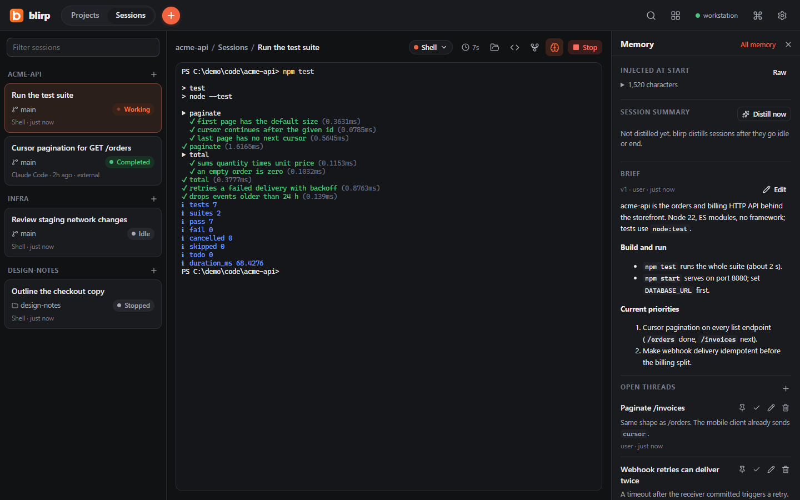
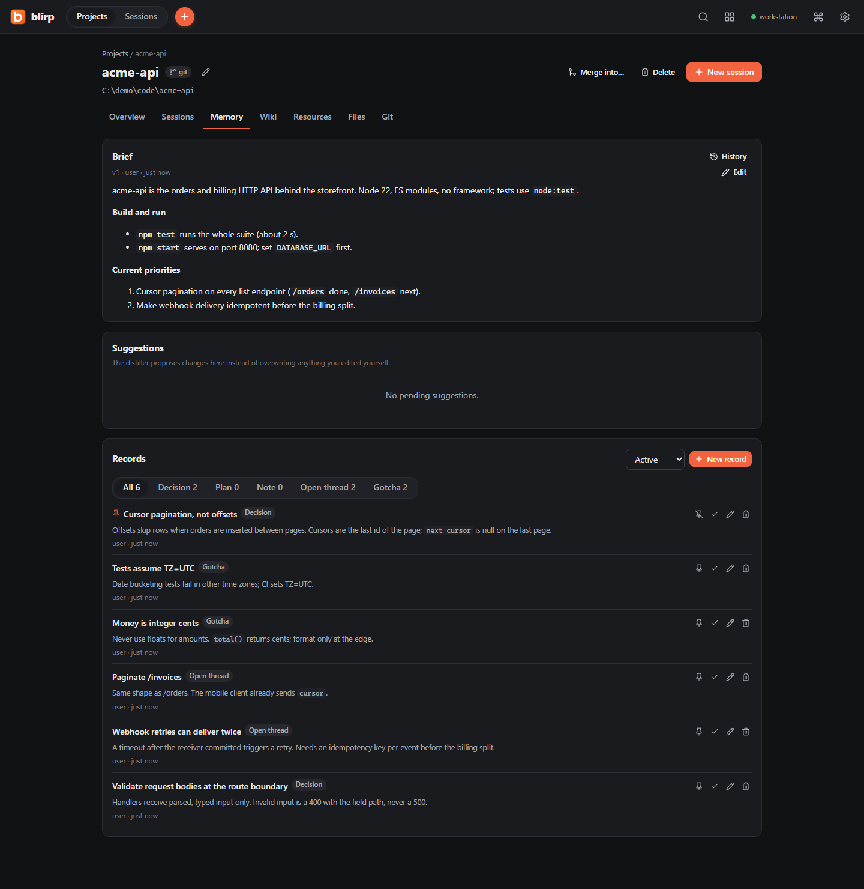
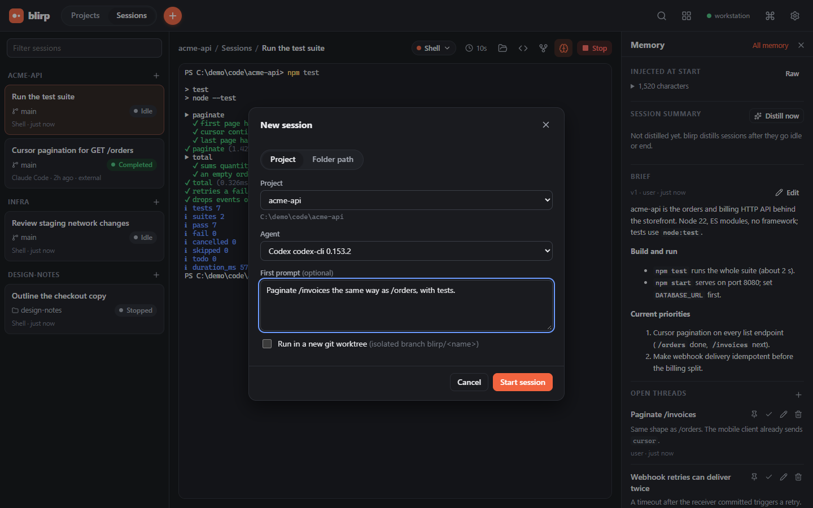
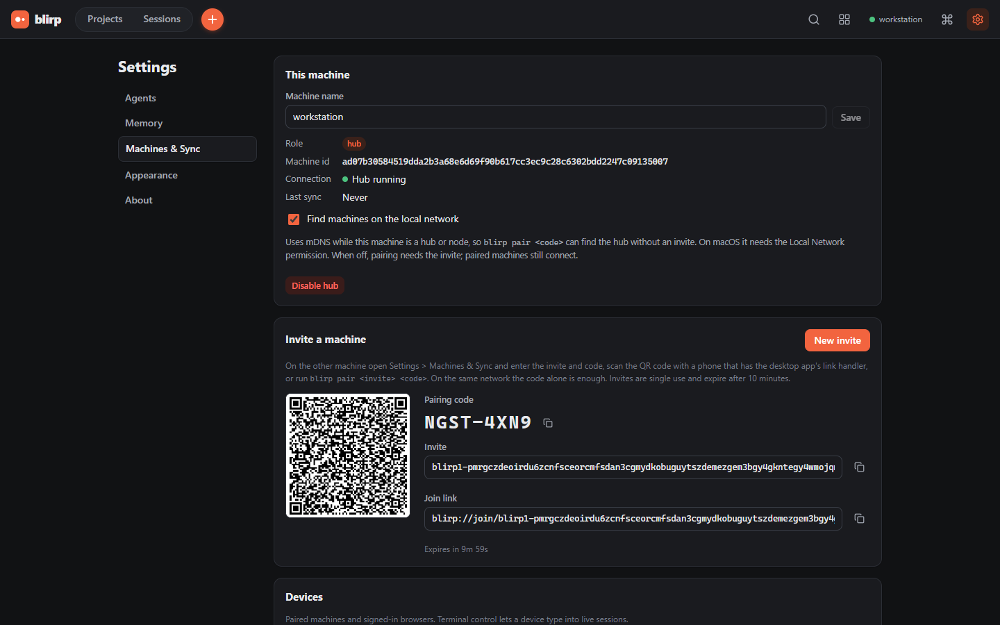
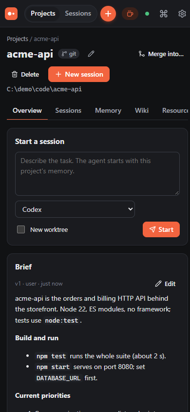

<div align="center">

# blirp

**Run your CLI coding agents in real terminals, and let every new session remember what the last one learned.**

[](https://github.com/backyarddd/blirp/actions/workflows/ci.yml)
[](LICENSE)


[Install](#install) · [Quick start](#quick-start) · [How memory works](#how-memory-works) · [Supported agents](#supported-agents) · [Docs](docs/README.md)

</div>



blirp is a free, open-source desktop app and daemon for Claude Code, Codex, opencode, Gemini CLI, Cursor CLI, Amp, pi, Aider, DeepSeek Harness (`dsh`) or any other command. Agents run unmodified in real terminal tabs. blirp tracks every session, including the ones you start in your own terminal, and hands each new session in a project a short, current memory of the work done before it.

> **Status:** pre-1.0 (0.x). Data formats can still change between minor versions.

## Why

Coding agents forget everything between sessions. Each new session re-reads the code, rediscovers the same pitfalls and reopens settled decisions, unless someone writes a handoff note by hand.

The agents already save full transcripts on disk. blirp reads them, keeps a project brief plus decisions, open threads and gotchas up to date, and gives that to the next session at startup through each agent's own mechanism (a startup hook, instructions or a flag). No handoff documents, no copy-pasting.

## Features

**Sessions**
- **Real terminals.** Agents run in a pseudo-terminal (ConPTY on Windows) rendered with xterm.js. Tabs, a grid of all live sessions, a notification when a session needs input.
- **Every session tracked.** Status (working, idle, waiting, completed, failed, ...), branch or folder, tokens and cost, transcript and summary. Sessions started outside blirp are picked up from the agents' own transcript stores, subagents included.
- **Projects are folders.** Git is optional. For git projects, a session can run in its own worktree on a `blirp/<name>` branch.
- **Continue in / fork.** Start a new session, with any agent, from a handoff pack of an earlier one.

**Memory**
- **Automatic.** Transcripts are redacted, then summarized by the summarizer you choose: your own `claude` or `codex` CLI, a local Ollama model, or nothing.
- **Visible and editable.** Brief versions with revert, records, a project wiki, resources and suggestions, all in the UI.
- **Searchable.** Older history through full-text search in the UI, `blirp mem` on the command line, and an MCP server the agents can call.

**Machines**
- **Optional self-hosted hub.** Pair machines with an 8-character code. Projects, sessions and memory replicate end to end encrypted over QUIC.
- **Cloud sessions.** Start a session on the hub from your laptop, close the lid, and pick it up later with its full scrollback.
- **Web portal.** A hub can serve the same UI over HTTPS on your LAN (or behind `tailscale serve`) for phones and other browsers, with per-device permissions.

**No accounts, no telemetry, no blirp servers.** blirp never proxies model traffic and never reads your agents' credentials; the only one it stores is an optional Claude Code login token you give it for a headless hub (`~/.blirp/secrets`, never synced).

## Screenshots

<table>
  <tr>
    <td width="50%"></td>
    <td width="50%"></td>
  </tr>
  <tr>
    <td align="center"><sub><b>Project memory.</b> The brief and the records the next session starts with.</sub></td>
    <td align="center"><sub><b>New session.</b> Any project, any installed agent, an optional first prompt.</sub></td>
  </tr>
  <tr>
    <td width="50%"></td>
    <td width="50%" align="center"></td>
  </tr>
  <tr>
    <td align="center"><sub><b>Hub pairing.</b> An invite and code, or a QR code.</sub></td>
    <td align="center"><sub><b>Phone width.</b> The UI a hub's web portal serves to phones.</sub></td>
  </tr>
</table>

## Install

macOS / Linux (x86_64 or arm64):

```sh
curl -fsSL https://raw.githubusercontent.com/backyarddd/blirp/main/install.sh | sh
```

Windows 10 1809+ / 11, in PowerShell:

```powershell
irm https://raw.githubusercontent.com/backyarddd/blirp/main/install.ps1 | iex
```

This installs the `blirp` CLI and the desktop app after checking every download against the release's `SHA256SUMS.txt`. No admin rights. Then run `blirp`. Update with `blirp update`, remove with `blirp uninstall`.

Options (`--no-app`, `--service`, `--version X`), manual downloads, system requirements and platform details: [docs/install.md](docs/install.md). To build from source, see [Building from source](#building-from-source).

## Quick start

1. **Run `blirp`.** It starts the daemon and opens the desktop app (or, with only the CLI, the UI in your browser, already signed in).
2. **Start a session.** Click the orange **+** (Ctrl+T, or Ctrl+Shift+T inside a terminal; Cmd+T on macOS), pick a project or type any folder path, and choose an agent. Only agents found on your `PATH` can be selected; `Shell` always works.
3. **Work as usual.** When the session has been idle for 5 minutes, or ends, blirp summarizes it into the project's memory.
4. **Start the next session** in the same folder, with the same or another agent. It begins with a `# blirp memory: <project>` block. Open **Memory** in the session toolbar to see exactly what it received.
5. **Optional:** `blirp hooks install` gives sessions you start in your own terminal the same memory (Claude Code, Codex, Gemini CLI, Cursor; MCP only for opencode). It edits those agents' user config, reversibly.

Closing the window keeps the daemon and every session running; the tray icon brings it back.

```sh
blirp status                     # is the daemon running, where, which version
blirp sessions                   # recent sessions
blirp mem search "pagination"    # search the memory of the current folder's project
blirp doctor                     # data dir, config, database, git, agents, ingest per agent
blirp service install            # start the daemon at login
```

Full walkthrough: [docs/getting-started.md](docs/getting-started.md).

## How memory works

```
 1  ingest    tail the agents' own transcripts (~/.claude, ~/.codex, opencode.db, ...)
 2  redact    secrets become [REDACTED:<kind>] before anything is stored
 3  distill   idle 5 min or ended -> summarizer -> title, summary, decisions,
              open threads, gotchas, and a new version of the project brief
 4  inject    the next session starts with: brief, open threads, recent decisions,
              gotchas, recent sessions (size-capped, stable order for prompt caches)
 5  recall    on demand: MCP tools (mem_search, mem_session, ...), `blirp mem`, UI search
```

- Terminal output is never scraped for memory; it only drives the live view and the idle heuristic.
- Your edits win: the distiller never overwrites a record you edited, and in review mode it proposes brief changes as suggestions.
- Distilling has a daily budget (40 runs by default) and can be turned off entirely.

Details, summarizer costs and every switch: [docs/memory.md](docs/memory.md).

## Hub and cloud sessions

Run blirp on an always-on machine (for example a Mac mini or a Linux box), turn on the hub role with `blirp hub enable` or **Settings > Machines & Sync**, and pair your other machines with `blirp pair <invite> <code>` (or just `blirp pair <code>` on the same LAN).

- Projects, sessions, transcripts, briefs, records, wiki pages and resources replicate through the hub.
- Start sessions on any paired machine and attach to their terminals remotely.
- **Cloud sessions:** choose **Run on > Cloud** to run a session on the hub; the hub stays awake while sessions run.
- Connections use QUIC (iroh) with NAT traversal, so the hub needs no port forwarding. The public relay fallback can be disabled or replaced.

Guides: [sync and hub](docs/sync-and-hub.md), [cloud sessions](docs/cloud-sessions.md), [web portal](docs/portal.md).

## Supported agents

**Verified** means checked against the installed CLI version shown. **Partial** means part of the integration was checked against real data and the rest follows the agent's documentation. **Docs** means implemented from the agent's official documentation or published format only.

| Agent | Memory at launch | MCP tools | Resume | Status |
|---|---|---|---|---|
| Claude Code (`claude`) | SessionStart hook | yes | `--resume` | Verified 2.1.283 |
| Codex (`codex`) | `developer_instructions` | yes | `codex resume` | Verified 0.153.2 |
| opencode (`opencode`) | `instructions` entry | yes | `--session` | Verified 1.18.25 |
| Gemini CLI (`gemini`) | SessionStart hook | yes | `--resume` | Docs |
| Cursor CLI (`cursor-agent`) | only with global hooks installed | only with global hooks installed | `--resume` | Partial (transcript ingest) |
| Amp (`amp`) | system prompt in a per-launch settings copy | yes | `threads continue` | Docs |
| pi (`pi`) | `--append-system-prompt` | no (use `blirp mem`) | relaunches fresh | Docs |
| Aider (`aider`) | `--read <memory file>` | no | relaunches fresh | Docs |
| DeepSeek Harness (`dsh`) | `BLIRP_MEMORY_FILE` only | no | relaunches fresh | Partial (transcript ingest) |
| Shell, or any command via `[[agents.custom]]` | `BLIRP_MEMORY_FILE` only | no | relaunches fresh | n/a |

Launching from blirp never edits your agent config: it passes flags, environment and generated files under `~/.blirp/launch/<session>/`. Transcript locations, hooks and per-agent details: [docs/agents.md](docs/agents.md).

Not supported: IDE-embedded agents (Copilot Chat in VS Code, the Cursor editor's own chat), cloud-only agents without a local CLI, proxying or metering model traffic.

## Security and privacy

- All state stays in `~/.blirp` (`%USERPROFILE%\.blirp` on Windows) on your own machines: one SQLite database plus config, keys and logs.
- Transcript text is redacted (cloud keys, tokens, private keys, JWTs, connection strings, `.env` lines, ...) before it is stored, synced or summarized. Logs never contain transcript text.
- What leaves the machine, and only if you use it: redacted excerpts go to the summarizer you picked (`none` sends nothing, Ollama stays local); sync is end to end encrypted to your paired machines, using public n0 relays for connection setup and fallback unless you set `sync.relay = "disabled"`; the daemon checks GitHub Releases for a new version at most daily unless `update.check = false`.
- The local API listens on `127.0.0.1` only. A hub or node also opens a UDP (QUIC) endpoint for sync, plus mDNS unless `sync.lan_discovery = false`; a standalone machine opens neither. The LAN portal is off by default and exists only on a hub.

Threat model and details: [docs/security.md](docs/security.md). Report vulnerabilities privately: [SECURITY.md](SECURITY.md).

## Documentation

| | |
|---|---|
| **Start** | [Getting started](docs/getting-started.md) · [Install](docs/install.md) · [FAQ](docs/faq.md) |
| **Use** | [Projects and sessions](docs/projects-and-sessions.md) · [Memory](docs/memory.md) · [Agents](docs/agents.md) |
| **Machines** | [Sync and hub](docs/sync-and-hub.md) · [Cloud sessions](docs/cloud-sessions.md) · [Web portal](docs/portal.md) |
| **Reference** | [Configuration](docs/configuration.md) · [CLI](docs/cli.md) · [HTTP API](docs/api.md) · [Security](docs/security.md) · [Troubleshooting](docs/troubleshooting.md) |
| **Develop** | [Development](docs/development.md) · [Architecture](docs/ARCHITECTURE.md) · [Contributing](CONTRIBUTING.md) |

## Building from source

Requirements: Rust 1.91+ (CI pins 1.94.0), Node.js 22, pnpm 12. For the desktop app also the [Tauri 2 prerequisites](https://v2.tauri.app/start/prerequisites/).

```sh
pnpm -C web install && pnpm -C web build     # the UI, embedded into the binary
cargo build --release -p blirp               # target/release/blirp
```

A source build is not touched by `blirp update` or `blirp uninstall`. Tests, the desktop app, regenerating these screenshots and the release process: [docs/development.md](docs/development.md).

## License

[Apache-2.0](LICENSE)
